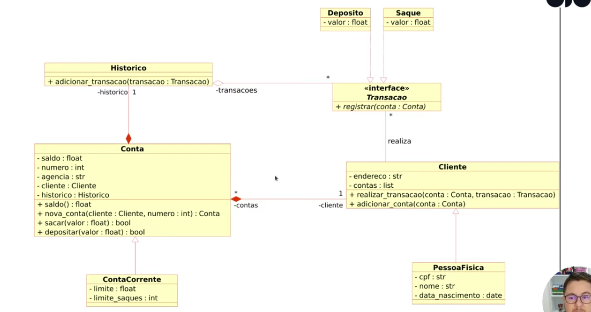

# Sistema Bancário em Python 💰

Projeto desenvolvido para praticar Programação Orientada a Objetos (OOP).

## Funcionalidades

* Criação de conta
* Depósito
* Saque com limite (conta corrente)
* Histórico de transações

## Estrutura

* Cliente
* Conta
* ContaCorrente
* Transações (Saque e Depósito)
* Histórico

## Como executar

```bash
python3 sistema_bancario.py
```

## Conceitos aplicados

* Herança
* Polimorfismo
* Classes abstratas (ABC)

## Diagrama UML
Veja o arquivo UML.png para entender a estrutura do sistema.

